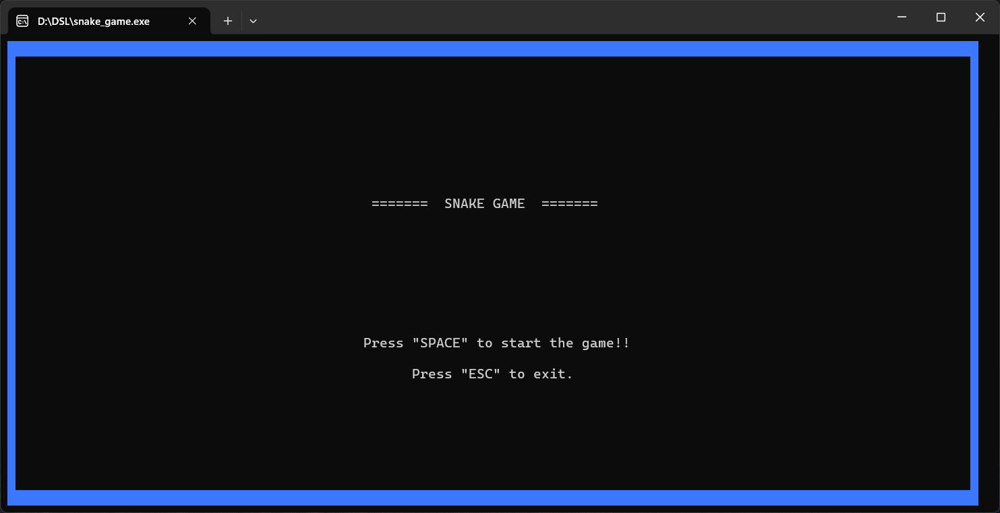
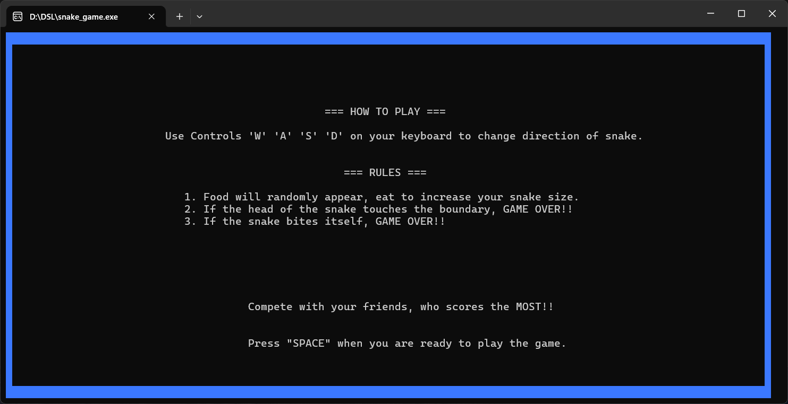
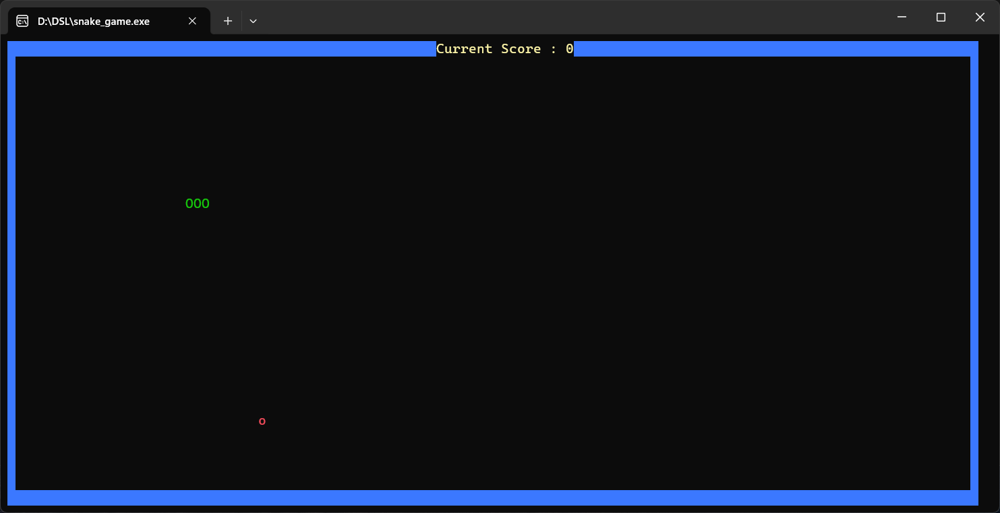
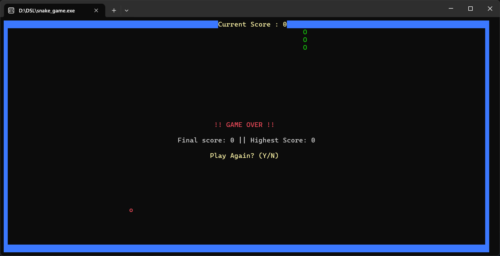

# Snake Game in C++

## Introduction
Hey everyone! 😊 This is a simple **Snake Game** written in C++ using the Windows console. The game is controlled with `W`, `A`, `S`, and `D` keys to move the snake. The goal is to eat food and grow the snake without hitting the walls or yourself. Hope you like it! 🎮🐍

## Screenshots

## How to Play
1. Run the program
2. Press `SPACE` to start the game
3. Use `W` (up), `A` (left), `S` (down), `D` (right) to move
4. Avoid hitting the walls and yourself!
5. Try to eat as much food as possible to get a high score! 🚀
6. After **Game Over**, you can restart or exit.

## How It Works
- The **Snake** moves in a direction continuously.
- The `Board` class manages the **snake** and **food**.
- The **game loop** updates the game, checks for collisions, and draws the snake.
- If the snake eats food, it **grows**.
- If the snake hits the wall or itself, **Game Over!**
- The highest score is saved during runtime.

## Data Structures Used
- **Arrays (`body[MAX_LENGTH]`)**: Used to store the snake's body coordinates. Each index represents a segment of the snake, with `body[0]` being the head.
- **Struct (`Point`)**: Defines a point with `xCoord` and `yCoord`, representing positions on the console screen.
- **Class (`Snake`)**: Manages snake properties such as movement, collision detection, and growth logic.
- **Class (`Board`)**: Handles the game environment, score tracking, and food generation.
- **Vector (`prevSnakeBody`)**: Stores previous positions of the snake to efficiently clear the old snake body from the console screen before redrawing it.
- **Randomization (`rand()`)**: Used in food generation to place food at random locations within the console window boundaries.

## Notes
- This game only works on **Windows** because it uses `windows.h` and `_getch()`.
- The game might flicker a bit due to the console update method.

Hope you like this game! Happy coding! 🚀
